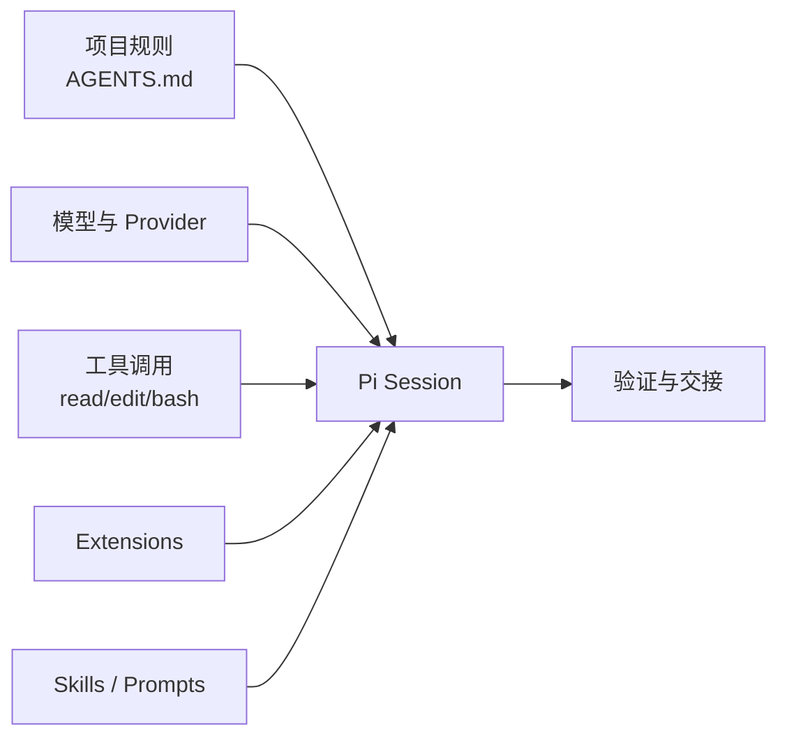

# 欢迎来到 Learn Pi Agent Harness

Learn Pi Agent Harness 是一份面向 [earendil-works/pi](https://github.com/earendil-works/pi) 的中文学习教程。本教程把 Pi 的上手使用、源码研读和 Harness Engineering（工具马具/脚手架工程）实践放在同一条学习路径里，帮助你把 terminal coding agent 变成可复用、可验证、可交接的工作系统。

本教程分为理论讲义、实战项目和开箱即用的资料库。

## 开始学习

选择适合你的学习路径：

  <a href="/lectures/">
    <strong>讲义</strong>
    理解 Pi 的模型、工具、上下文、会话、扩展和技能机制。
  </a>
  <a href="/projects/">
    <strong>项目</strong>
    动手实践，从第一次仓库分析走到完整 Pi Harness。
  </a>
  <a href="/resources/">
    <strong>资料库</strong>
    复制 AGENTS.md、Prompt Template、Skill 和 Extension 模板。
  </a>

## Pi Harness 的核心机制

Harness 的本质不是“让模型变聪明”，而是给模型建立一套闭环的工作系统。Pi 提供了这套系统所需的关键部件：

## 你将学到什么

- 用明确的项目规则约束 agent 的行为。
- 在跨会话的长任务中保持上下文连续。
- 用 compaction 管理上下文窗口，而不是丢失关键状态。
- 用 Extension、Skill 和 Prompt Template 固化团队工作流。
- 用验证清单防止 agent 提前宣告完成。
- 通过源码地图理解 Pi monorepo 的主要包边界。

## 下一步

了解核心概念后，可以从以下内容继续：

- [L01. Pi 是什么](/lectures/01-what-is-pi)：从理论和定位开始。
- [P01. 第一次仓库分析](/projects/01-first-repo-analysis)：完成你的第一个 Pi 实战任务。
- [Pi 上手检查清单](/resources/checklist)：获取最小工作清单，直接用于你的项目。

